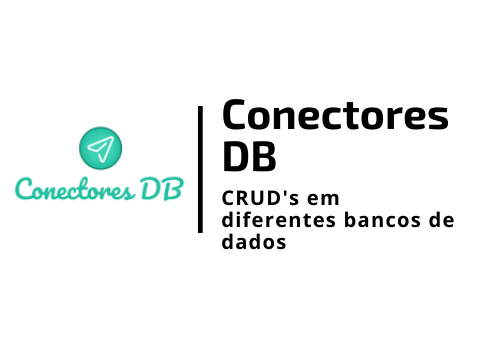

<h1 align="center">
    
</h1>

<h4 align="center"> 
	🚧 Conectores DB 1.0 🚀 em desenvolvimento... 🚧
</h4>

  

  

  	
  
	
  
  

  
   

## 💻 Sobre o projeto

📷 **Conectores DB** é um projeto que permite **interagir com diferentes Banco de Dados** realizando **Abertura da Conexão**, **Execução da Query** e **Fechamento da Conexão**.

Atualmente funcionando para:

 1. SQLITE3
 2. Microsoft Access

## 🛠  Tecnologias

As seguintes ferramentas foram usadas na construção do projeto:

- [Python]

## 🚀 Como executar o projeto

1. **Instalando**: pip install -r requirements.txt
2. **Importando**: from main import conectores

## ➊ Pré-requisitos

Antes de começar, você vai precisar ter instalado em sua máquina as seguintes ferramentas (O download pode ser realizado pela própria página do Python ou Anaconda):
[Python](https://www.anaconda.com/products/individual).

## 💾 Databases - CRUD's disponíveis
Classificador de tipo de PDF usando cálculo de percentual de texto contido no PDF.

| Banco de Dados        | Ações disponíveis 
| ------------- |:--------------------:|
| SQLITE3| SELECT, INSERT, INSERT MANY, UPDATE, DELETE, TRUNCATE  |
| Microsoft Access | SELECT, INSERT, INSERT MANY, UPDATE, DELETE, TRUNCATE  |

## 📝 Licença

Este projeto está sob a licença MIT.

Feito com ❤️ por **Emerson Rafael** 👋🏽 [Entre em contato!](https://www.linkedin.com/in/emerson-rafael/)

[Python]: https://www.python.org/downloads/